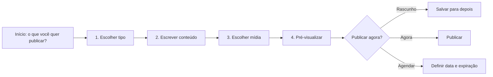

# Plano de implementação da dashboard FlaMedula

## Objetivo de produto

Permitir que uma pessoa não técnica crie, revise, agende e publique conteúdo com segurança, enxergando o resultado antes de colocar algo no site. O fluxo principal deve exigir poucas decisões por tela e usar linguagem editorial, não nomes de tabelas.

## Estado implementado localmente

- assistente editorial em 3 etapas: conteúdo, mídia e revisão;
- salvamento automático local, preview desktop/mobile, rascunho, publicação imediata, agendamento e expiração;
- registro único para notícias, ações, mídias, depoimentos, equipe, FAQ e indicadores públicos;
- views públicas estreitas com janela de publicação e fallback observável no site;
- RBAC por aplicação, RLS por operação, auditoria automática e rate limit compartilhado;
- segunda implementação antiga do editor e mocks órfãos removidos;
- validação automatizada das migrations e build de produção do site.

As migrations e Edge Functions ja foram aplicadas em um staging limpo. A matriz
`owner`/`editor`/`viewer`, o administrador permanente e a assinatura Cloudinary
foram validados. Ainda falta executar publicacao/agendamento ponta a ponta pela
interface e configurar alertas operacionais. Esse staging nao e uma copia do banco real; a promocao para
producao continua condicionada a backup e ensaio de rollback.

## Layout proposto

### Navegação principal

- **Visão geral**: pendências, itens agendados, erros de mídia e atividade recente.
- **Publicar**: botão primário que inicia o assistente.
- **Conteúdos**: lista única com filtros por tipo, status e responsável.
- **Biblioteca de mídia**: imagens com uso, texto alternativo e disponibilidade pública.
- **Cadastros**: doadores, pacientes e apoios, separado do CMS por permissão.
- **Configurações e acessos**: somente para responsáveis autorizados.

### Assistente de publicação

1. cartões visuais para `Notícia principal`, `Ação`, `Mídia`, `Depoimento`, `Equipe` e `Pergunta frequente`;
2. formulário com exemplos, validação em linha e salvamento automático local;
3. etapa de mídia com upload, biblioteca e texto alternativo quando aplicável;
4. revisão com preview em desktop e celular;
5. ações finais `Salvar rascunho`, `Agendar` ou `Publicar agora`.

## Arquitetura de código

O diretório `assets/js/publication/` é o fluxo editorial canônico. O registro único de conteúdo já alimenta lista, formulário, validação e preview; a implementação duplicada em `assets/js/content/` e os mocks órfãos foram removidos.

Próxima refatoração estrutural: dividir `app.js` por domínio (`dashboard`, `donors`, `patients`, `support`, `audit`) sem alterar contratos do banco.

## Contrato de backend já preparado

- `admin_profiles`: papel global para módulos operacionais;
- `admin_app_access`: papel por aplicação (`owner`, `editor`, `viewer`);
- RLS por ação: leitura, criação, atualização e exclusão separadas;
- `created_by`, `updated_by`, `published_by`, `published_at` e `revision_number` preenchidos no banco;
- `scheduled_for` e `expires_at` para agendamento;
- auditoria editorial automática;
- views públicas limitadas, sem IDs de autores ou campos administrativos.

## Entregas por fase

| Fase | Entrega | Critério de aceite |
|---|---|---|
| 0 — fundação | schema reconciliado, RBAC, auditoria, privacidade e rate limit | migrations passam em banco limpo e clone; matriz de acesso validada |
| 1 — editor seguro | corrigir XSS, paginação server-side e consolidar registro de conteúdo | editor/viewer/owner respeitam o mesmo contrato no UI e no banco |
| 2 — assistente | fluxo em 5 passos, autosave e preview responsivo | usuário não técnico publica em teste sem orientação externa |
| 3 — conteúdo completo | depoimentos, equipe, FAQ e métricas saem de arquivos estáticos | todos os blocos têm rascunho, preview e fallback explícito |
| 4 — operação | agendamento, versões, desfazer e alertas de falha | publicação agendada ocorre na janela e pode ser auditada |
| 5 — qualidade | testes unitários, integração/RLS, E2E mobile e CI | deploy bloqueia regressões críticas |

## Cuidados de implantação

- nunca usar a interface como única barreira de autorização;
- nunca testar exclusão ou bypass de permissão em produção;
- importar um backup real em staging antes das migrations;
- publicar banco, Edge Functions, dashboard e site na ordem documentada;
- manter fallback do site observável: conteúdo estático não pode mascarar indefinidamente um erro do CMS;
- não automatizar publicação por horário apenas no navegador; usar scheduler confiável no backend.
