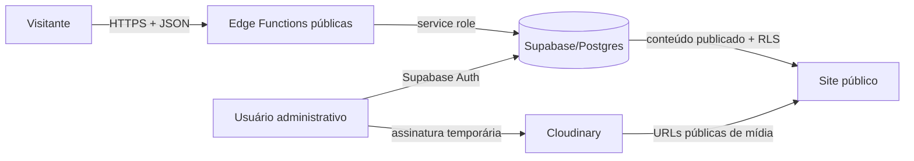

# Modelo de ameaças — FlaMedula

Versão inicial: 2026-07-13. Escopo: site público, dashboard administrativa, Supabase, Edge Functions e Cloudinary.

## Ativos e fronteiras de confiança

| Ativo | Sensibilidade | Fronteira principal |
|---|---|---|
| Cadastros de doadores | dados pessoais e consentimento | navegador público → Edge Function → Supabase |
| Casos de pacientes | dados pessoais e contexto potencialmente sensível | navegador público → Edge Function → Supabase |
| Intenções de doação | contato, valor e aceite | navegador público → Edge Function → Supabase |
| Conteúdo publicado | reputação e integridade institucional | navegador do operador → Supabase/Cloudinary → site público |
| Sessões administrativas | credencial de alto impacto | navegador do operador → Supabase Auth |
| Segredos de serviço | acesso privilegiado | ambiente da Edge Function, nunca frontend |

## Fluxo de dados resumido

## Ameaças prioritárias (STRIDE/LINDDUN)

| ID | Ameaça | Impacto | Controle implementado nesta fase | Risco residual |
|---|---|---|---|---|
| T-01 | alteração/exclusão de conteúdo por papel inadequado | alto | autorização server-side por aplicação e papel; exclusão somente `owner` | validar todos os papéis em staging |
| T-02 | XSS armazenado por título, URL ou texto alternativo | alto | codificação de atributo e allowlist de URL no CMS | revisar os demais `innerHTML` legados |
| T-03 | abuso automatizado dos formulários | alto | contador atômico compartilhado, hash do identificador, HTTP 429 e `Retry-After` | adicionar CAPTCHA e limite de borda/WAF |
| T-04 | schema versionado divergente do banco real | alto | migration de reconciliação aditiva e idempotente | comparar com export real antes do deploy |
| T-05 | coleta de CPF/e-mail sintéticos | alto | remoção do dado inventado; valor pretendido em campo explícito | definir retenção e descarte dos legados |
| T-06 | acesso excessivo a dados pessoais | alto | matriz por domínio e RLS; `viewer` somente leitura | testar acesso horizontal/vertical com contas de staging |
| T-07 | publicação sem trilha de autoria | médio/alto | triggers de autoria, versão e auditoria para conteúdo | definir retenção dos logs |
| T-08 | enumeração/vazamento por views | alto | grants explícitos e projeção pública limitada de mídia | auditar grants do banco real |
| T-09 | origem ausente aceita por endpoint público | médio | mantida para clientes não-browser; rate limit e validação continuam obrigatórios | decidir se integrações server-to-server precisam existir |
| T-10 | dependências/CDNs não fixados | médio | registrado para fase de supply chain | fixar versões e adicionar CSP/SRI |

## Critérios de validação

- conta `viewer` não cria, altera, publica ou exclui;
- conta `editor` cria/edita/publica, mas não exclui;
- conta `owner` pode excluir conteúdo;
- visitante anônimo só lê registros publicados e colunas públicas;
- Edge Functions não aceitam campos administrativos ou dados de cartão;
- o sexto envio dentro da janela configurada retorna 429 com `Retry-After`;
- nenhuma informação pessoal bruta é gravada na tabela de rate limit;
- cada alteração editorial gera autoria, número de revisão e log de auditoria.
